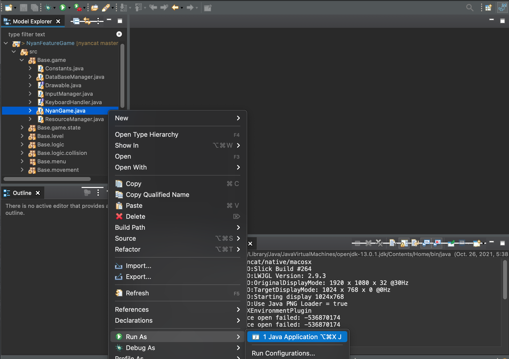

# NyanCat Game

*Avoid planet collisions, collect rainbows and saxes!*

## About

*NyanCat Game* is simple. You start with 7 lifes and must find your way through space. If you hit a planet you'll lose a life (rainbow segment), so make sure to collect 1-UPs as you navigate.  
On top, you can collect saxophones to enter Jazz-Mode. It's more or less the same, only way cooler: Smoother music, sunglasses and an awesome saxophonist.


 > Want to see more? Watch the [*"Let's Play!" Video*](documentation/letsplay.mp4?raw=true)

## How to build / run

Unfortunately you need Eclipse (Boooh!) to play the *NyanCat Game*.

 * [Download and install Eclipse](https://www.eclipse.org/downloads/packages/release/2021-09/r/eclipse-ide-java-developers)
 * [Download and install Java-8](https://www.oracle.com/java/technologies/javase/javase8u211-later-archive-downloads.html) (tested with java 1.8.0_241-b07)  
  ```export JAVA_HOME=$(/usr/libexec/java_home -v 1.8)``` (MacOS)
 * Clone this repository  
  ```git clone https://github.com/tschnuchel/nyancat.git```
 * Open the project sources in Eclipse  
  ```File -> Import -> General -> Existing Projects into Workspace ->``` *Path to Sources*
 * Launch the game:  
```Rightclick on NaynGame.java -> Run As -> Java Application```  


## Credits

 * Program Code: [tschuchel](https://github.com/tschnuchel)
 * Documentation / Let's Play!: [kartoffelquadrat](https://github.com/kartoffelquadrat)
